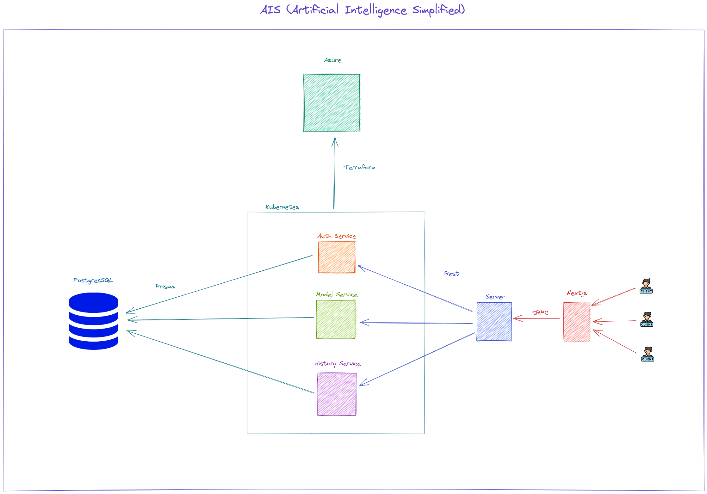

# AIS (Artificial Intelligence Simplified)

AIS is an application that will allow users to easily create and manage Machine Learning models. Users will be able to choose which model they want to use, and then they will be able to train and test the model. The application will also allow users to save their models and load them later. 

## Architecture

The application will be built following the microservices architecture, here a more detailed description of the architecture:

## Technologies

The application will be built using the following technologies:

### Next.js

Next.js is a framework that allows us to build React applications with server-side rendering. It also allows us to build static websites. It is a framework that is very easy to use and it is very popular.

### Node.js

Node.js is a JavaScript runtime environment that allows us to run JavaScript code outside of the browser. It is a very popular technology and it is used in many applications.

### Docker

Docker is a containerization platform that allows us to run applications in containers. It will allows to run each microservice in a container.

### Kubernetes

Kubernetes is a container orchestration platform that allows us to manage containers. It will allow us to manage the containers that are running the microservices.

### Terraform

Terraform is a tool that allows us to create and manage infrastructure as code. It will allow us to create the infrastructure that will run the application.